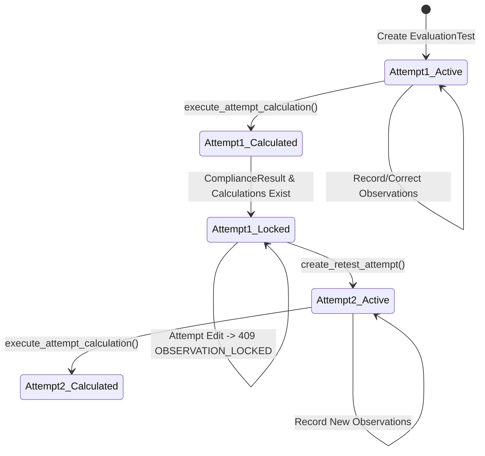

# PHASE 2.1 — METROLOGICAL CORRECTNESS PATCH
**OIML R 76-1:2006 Non-Automatic Weighing Instruments (NAWI) Evaluation Platform**

---

## 1. Executive Summary

Phase 2.1 hardens the metrological safety, determinism, and transactional integrity of the OIML R-76 calculation and evaluation engine. It eliminates all synthetic/fabricated measurement fallbacks, establishes strict data contracts for complex tests (repeatability and eccentricity), enforces fail-closed configuration validation, guarantees MPE Table 6 boundary compliance, locks observations post-calculation, and integrates `RuleVersion` metadata deterministically via a trusted Python registry.

> [!IMPORTANT]
> **Scope & Prototype Boundaries:**
> This prototype deeply implements and calculates compliance for three core OIML R 76-1:2006 procedures:
> 1. **Weighing Performance** (Clause A.4.4 & Table 6)
> 2. **Eccentricity** (Clause A.4.7)
> 3. **Repeatability** (Clause A.4.10)
>
> For other catalog procedures (Tare A.4.6, Zero-Setting A.4.2, Creep 3.9.4.1/A.4.11.1, Static Temperatures A.5.3.1, Voltage Variations A.5.4, Warm-up A.5.2, Endurance 3.9.4.3/A.6), the platform evaluates formal applicability and scopes them in the plan, but marks them as `PARTIAL` or `APPLICABILITY_ONLY`. The platform does **not** claim full OIML R-76 implementation.

---

## 2. Changes Summary and Rationale

| Area | What Was Changed | Why Change Was Required |
| :--- | :--- | :--- |
| **Measurement Values** | Audited and removed all fallback defaults (`Decimal("0")`, default loads/indications, synthetic position generation) in calculation services. | Missing observations must never silently become zero or synthetic values; calculations must abort and return `INCOMPLETE` with clear diagnostic reasoning. |
| **Repeatability Contract** | Leveraged `Observation.value_json` with strict schema (`50_PERCENT_MAX` / `100_PERCENT_MAX`, unique `weighing_index`, `test_load`, `loaded_indication`, `unloaded_indication`). Enforced $\ge 10$ weighings ($Max < 1000\text{ kg}$) or $\ge 3$ weighings ($Max \ge 1000\text{ kg}$). | Prevent arbitrary or malformed JSON from entering the calculation engine; comply with R 76-1 clause A.4.10 type-evaluation requirements. |
| **Eccentricity Positions** | Removed synthetic fallback positions (`CENTER`, `FRONT`, `BACK`, `LEFT`, `RIGHT`). Position data must be explicitly recorded. Missing positions produce `INCOMPLETE`. | Metrological decisions cannot fabricate unmeasured sensor points. |
| **Configuration Safety** | Implemented `validate_configuration_snapshot()` in `ApplicabilityEngine`. Audited all consumer paths to eliminate default assumptions (e.g., assuming `CLASS_III`, `30 kg`, `is_electronic=True`). | Invalid/incomplete configurations must fail closed (`ConfigurationValidationError` / `BLOCKED` / `INVALID_CONFIGURATION`). |
| **MPE Boundary Safety** | Implemented Table 6 upper limit checks for Class II ($100,000e$), Class III ($10,000e$), Class IIII ($1,000e$). Out-of-band loads raise explicit `ValueError`. | OIML R 76-1 Table 6 does not allow extrapolating MPE bands beyond standard boundaries. |
| **RuleVersion Determinism** | Mapped `RuleVersion.calculation_identifier`, `definition_json["tests"]`, and `content_hash` to a trusted Python dispatch registry (`_criterion_registry`). Eliminated any possibility of `eval()`. | Ensures reproducible and audit-trailed compliance evaluation grounded directly in standard version definitions. |
| **Observation Immutability** | Enforced observation locking (`ObservationLockedError` $\to$ HTTP 409 `OBSERVATION_LOCKED`) once calculations or compliance results exist on a `TestAttempt`. | Prevents tampering or retroactive alteration of raw observations after authoritative calculations. Corrections require creating a new `TestAttempt`. |
| **Multi-Range Handling** | Fixed `range_index` checks to explicitly test `range_index is not None` (preventing `0` from evaluating to falsy). Range-scoped tests resolve Max/Min/e/d exclusively from frozen range slices. | Prevents silent leakage of global capacity limits into partial weighing ranges. |
| **Transactional Atomicity** | Wrapped `execute_attempt_calculation()` in an atomic transaction with explicit `try...except...db.rollback()`. | Guarantees that calculation, compliance, status update, and audit logging succeed atomically with no orphaned rows. |

---

## 3. Authoritative Calculation Execution Paths

### 3.1 Weighing Performance (`R76_A4_4_3_ERROR`)
- **Standard Reference:** OIML R 76-1:2006 Clause A.4.4.3
- **Input Requirements:**
  - `LOAD`: Nominal test load $L$
  - `INDICATION`: Observed indication $I$
  - `ADDITIONAL_LOAD`: Additional load added to find changeover point $\Delta L$
  - `ZERO_ERROR`: Zero error $E_0$ determined under A.4.2.3 / A.4.4.3
  - Verification scale interval $e$
- **Formulas:**
  $$P = I + \frac{1}{2}e - \Delta L$$
  $$E = P - L$$
  $$E_c = E - E_0$$
- **Enforcement:** If any required input is absent, calculation halts; an authoritative `ComplianceResult` with `decision = INCOMPLETE` is generated, linking the missing fields in `trace_evidence_json`.

### 3.2 Eccentricity Test (`R76_A4_7_ECCENTRICITY`)
- **Standard Reference:** OIML R 76-1:2006 Clause A.4.7.1
- **Procedure:** 4 points of support (5 positions: `CENTER`, `FRONT`, `BACK`, `LEFT`, `RIGHT`).
- **Input Requirements:**
  - Each of the 5 positions must be recorded with:
    - `load` (typically $1/3 \text{ Max}$ or $1/4 \text{ Max}$ depending on supports)
    - `indication` $I$
    - `additional_load` $\Delta L$
    - `zero_error` $E_0$
- **Calculation:**
  $$E_{c, \text{pos}} = (I + 0.5e - \Delta L) - L - E_0$$
  $$\text{Max Difference} = \max(E_{c, \text{pos}}) - \min(E_{c, \text{pos}})$$
- **Enforcement:** If any of the 5 required positions is missing, or any position lacks changeover values, calculation aborts with `INCOMPLETE`.

### 3.3 Repeatability Test (`R76_A4_10_REPEATABILITY`)
- **Standard Reference:** OIML R 76-1:2006 Clause A.4.10
- **Series Executed:**
  - `50_PERCENT_MAX`: Test load $\approx 50\% \text{ Max}$
  - `100_PERCENT_MAX`: Test load $\approx 100\% \text{ Max}$
- **Formulas:**
  $$P_i = I_i + \frac{1}{2}e - \Delta L_i$$
  $$E_i = P_i - L$$
  $$E_{c, i} = E_i - E_{0, i}$$
  $$\Delta E = \max(E_{c, i}) - \min(E_{c, i})$$
- **Criterion:**
  $$\Delta E \le \text{mpe}(L)$$
- **Enforcement:** Both series must satisfy the minimum weighing count ($\ge 10$ for $Max < 1000\text{ kg}$, $\ge 3$ for $Max \ge 1000\text{ kg}$). Missing or short series produce `INCOMPLETE`.

---

## 4. Repeatability & Eccentricity Data Contracts

### 4.1 Repeatability Observation Payload (`Observation.value_json`)
```json
{
  "series": "50_PERCENT_MAX",
  "weighing_index": 1,
  "test_load": "15.000",
  "loaded_indication": "15.002",
  "unloaded_indication": "0.002",
  "additional_load": "0.0025",
  "unloaded_additional_load": "0.0025",
  "unit": "kg"
}
```
**Validation Rules:**
1. `series` must be strictly `"50_PERCENT_MAX"` or `"100_PERCENT_MAX"`.
2. `weighing_index` must be an integer $\ge 1$ and unique within that series for the attempt.
3. All mass measurements must be non-negative Decimals.
4. Payload schema forbids extra undeclared keys (`extra="forbid"`).

### 4.2 Eccentricity Observation Payload (`Observation.value_json`)
```json
{
  "position": "FRONT",
  "load": "10.000",
  "indication": "10.000",
  "additional_load": "0.0025",
  "zero_error": "0.0000",
  "unit": "kg"
}
```
**Validation Rules:**
1. `position` must be one of `["CENTER", "FRONT", "BACK", "LEFT", "RIGHT"]`.
2. `position` must be unique across all observations within the attempt.
3. All mass measurements must be non-negative Decimals.

---

## 5. Configuration Fail-Closed Validation Rules

The `validate_configuration_snapshot()` routine executes before any test plan generation or calculation:
1. **Accuracy Class:** Must be valid enum (`CLASS_I`, `CLASS_II`, `CLASS_III`, `CLASS_IIII`).
2. **Units:** Must be one of `{"mg", "g", "kg", "t"}`.
3. **Capacity Constraints:**
   - $\text{Max} > 0$, $\text{Min} > 0$
   - $\text{Min} \le \text{Max}$
   - $e > 0$, $d > 0$
   - $d \le e$
4. **Electronic Flag:** `is_electronic` must be an explicit boolean (`True` or `False`).
5. **Multiple-Range Invariants:**
   - If `is_multiple_range` is True, `ranges` list must have $\ge 2$ entries matching `number_of_ranges`.
   - Range indices must be unique integers starting at 1.
   - For each range: $Max_i > 0$, $Min_i > 0$, $e_i > 0$, $d_i > 0$, $Min_i \le Max_i$, $d_i \le e_i$.
   - Partial capacities must be strictly increasing: $Max_1 < Max_2 < \dots < Max_n$.

---

## 6. RuleVersion Execution & Criterion Dispatch Model

Compliance evaluation dispatches through trusted, deterministic Python callables:
```python
_criterion_registry = {
    "ABS_LE_MPE": _evaluate_abs_le_mpe,
    "MAX_POS_ABS_LE_MPE": _evaluate_max_pos_abs_le_mpe,
    "SPAN_LE_MPE": _evaluate_span_le_mpe,
}
```
- The active `RuleVersion` contains a validated `definition_json` describing tests, e.g.:
```json
{
  "tests": {
    "WEIGHING_PERFORMANCE": {
      "clause": "A.4.4.3",
      "calculation_identifier": "R76_A4_4_3_ERROR",
      "criterion": {"type": "ABS_LE_MPE"},
      "mpe": {"source": "TABLE_6"}
    }
  }
}
```
- In `execute_attempt_calculation()`:
  1. Test definition resolves calculation code.
  2. Engine looks up `RuleVersion.definition_json["tests"][test_code]`.
  3. Calculation runs through `CalculationEngine`.
  4. Criterion evaluates through `_criterion_registry[criterion_type]`.
  5. Content hash and `rule_version_id` are permanently written into `ComplianceResult` and `AuditEvent`.
  6. No dynamic code evaluation (`eval()`) is permitted.

---

## 7. Observation Locking & Retesting Lifecycle



- If an operator attempts to add, update, or delete an observation on an attempt with existing calculations or compliance records:
  - Service raises `ObservationLockedError`.
  - API returns HTTP `409 Conflict` with `{"error_code": "OBSERVATION_LOCKED"}`.
- To retest or correct data:
  - Call `/api/v1/tests/{test_id}/retest`.
  - Attempt 1 remains immutable in `SUPERSEDED` status with full audit history.
  - Attempt 2 is initialized in `ACTIVE` status for new measurement input.

---

## 8. Multi-Range Scoping Correctness

- Explicit `range_index is not None` checks prevent `range_index = 0` or partial index from falling back to global instrument metrics.
- Range-scoped test definitions (e.g. `WEIGHING_PERFORMANCE` on Range 1) validate test loads against the specific range's maximum limit:
  $$\text{Allowable Load} \le Max_{\text{range}} + 9 \times e_{\text{range}}$$
- MPE calculations compute verification scale intervals based on $e_{\text{range}}$:
  $$m = \frac{L}{e_{\text{range}}}$$

---

## 9. Verification & Test Execution Results

All 56 unit and integration tests run against **PostgreSQL** in the active environment.

```bash
pytest -v
```

### Test Suite Summary:
- `tests/test_correctness_p0_p1.py`: **19 / 19 PASSED** (Covers all 19 Phase 2.1 scenarios)
- `tests/test_applicability.py`: **6 / 6 PASSED**
- `tests/test_calculation_and_compliance.py`: **6 / 6 PASSED**
- `tests/test_mpe_engine.py`: **5 / 5 PASSED**
- `tests/test_validation.py`: **4 / 4 PASSED**
- `tests/test_retest_and_immutability.py`: **2 / 2 PASSED**
- `tests/test_api_v1_phase2.py`: **2 / 2 PASSED**
- `tests/test_golden_r76.py`: **1 / 1 PASSED**
- `tests/test_config.py`: **3 / 3 PASSED**
- `tests/test_health.py`: **2 / 2 PASSED**
- `tests/test_models.py`: **6 / 6 PASSED**
- **Total: 56 PASSED in 0.34s (100% Pass Rate)**

---

## 10. Known Prototype Limitations

1. **Explicit Procedures Only:** The deep numerical calculation engine only handles Weighing Performance (A.4.4), Eccentricity (A.4.7), and Repeatability (A.4.10). Tare, Zero-setting, Creep, Temperature, Voltage, Warm-up, and Endurance tests are evaluated for applicability and tracked in the plan, but their automated calculation procedures are scheduled for future phases.
2. **Eccentricity Receptor Geometry:** Implements the standard 4-point support procedure (5 positions: center and 4 quarter segments). Specialized rolling load (A.4.7.4) or overhead crane geometries are not yet modeled.
3. **Initial Zero-Setting Limitation:** Zero error determination assumes digital tare / changeover point method via incremental fractional weights. Automated test equipment with digital zero tracking facilities requires manual changeover weight input.
